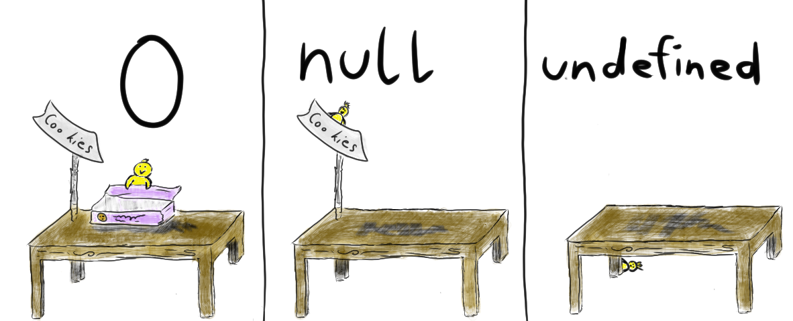

# 你真的掌握变量和类型了吗（一）数据类型

## 导读

变量和类型是学习 `Javascript` 最先接触到的东西，但是往往看起来最简单的东西往往还隐藏着很多你不了解、或者容易犯错的知识，比如下面几个问题：

- `Javascript` 中的变量在内存中的具体存储形式是什么？
- `0.1+0.2` 为什么不等于 `0,3` ？发生小数计算错误的具体原因是什么？
- `Symbol` 的特点，以及实际应用场景是什么？
- `[] == ![]` 、`[undefined] == false` 为什么等于 `true` ？代码中何时会发生隐式类型转换？转换的规则是什么？
- 如何精确的判断变量的类型？

如果你还不能很好的解答上面的问题，那说明你还没有完全掌握这部分的知识，那么请好好阅读下面的文章吧。

本文从底层原理到实际应用详细介绍了 `Javascript` 中的变量和类型相关知识。

## 一、JavaScript数据类型

[ECMAScript标准](http://www.ecma-international.org/ecma-262/9.0/index.html) 规定了7中数据类型，其把这7种数据类型又分为两种：原始类型和对象类型。

**原始类型**

- `Null`：只包含一个值 `null`
- `Undefined`：只包含一个值 `undefined`
- `Boolean`：包含两个值 `true` 和 `false`
- `Number`：整数或浮点数，还有一些特殊值（`-Infinity`、`+Infinity`、`NaN`）
- `String`：一串表示文本值的字符序列
- `Symbol`：一种实例是唯一且不可改变的数据类型

（在 `ES10` 中加入了第七种原始类型 `BigInt`，现已被最新 `Chrome` 支持）

**对象类型**

- `Object`：自己分一类丝毫不过分，除了常用的 `Object`，`Array`、`Function` 等都属于特殊的对象

## 二、为什么区分原始类型和对象类型

### 2.1 不可变性

上面所提到的原始类型，在 `ECMAScript` 标准中，它们被定义为 `primitive values`，即原始值，代表值本身是不可被改变的。

以字符串为例，我们在调用操作字符串的方法时，没有任何方法是可以直接改变字符串的：

``` javascript
var str = 'AaronKong';
str.slice(1);
str.substr(1);
str.trim(1);
str.toLowerCase(1);
str[0] = 1;
console.log(str); // AaronKong
```

在上面的代码中我们对 `str` 调用了几个方法，无一例外，这些方法都在原字符串的基础上产生了一个新字符串，而非直接去改变 `str`，这就印证了字符串的不可变性。

那么，当我们继续调用下面的代码：

``` javascript
str += '6';
console.log(str); // AaronKong6
```

你会发现， `str` 的值被改变了，这不就打脸了字符串的不可变性么？其实不然，我们从内存上来理解：

在 `JavaScript` 中，每一个变量在内存中都需要一个空间来存储。

内存空间又被分为两种，栈内存与堆内存。

栈内存：

- 存储的值大小固定
- 空间较小
- 可以直接操作其保存的变量，运行效率高
- 由系统自动分配存储空间

`JavaScript` 中的原始类型的值被直接存储在栈中，在变量定义时，栈就为其分配好了内存空间。


由于栈中内存空间的大小是固定的，那么注定了存储在栈中的变量就是不可变的。

在上面的代码中，我们执行了 `str += '6'` 的操作，实际上是在栈中又开辟了一块内存空间用于存储 `AaronKong6`，然后将变量 `str` 指向这块空间，所以这并不违背 `不可变性的` 特点。


### 2.2 引用类型

堆内存：

- 存储的值大小不定，可动态调整
- 空间较大，运行效率低
- 无法直接操作其内部存储，使用引用地址读取
- 通过代码进行分配空间

相对与上面具有不可变性的原始类型，我习惯把对象称为引用对象，引用类型的值实际存储在堆内存中，它在栈中只存储了一个固定长度的地址，这个地址指向堆内存中的值。

``` javascript
var obj1 = {name:"Aaronkong"};
var obj2 = {age:18};
var obj3 = function(){...};
var obj4 = [1,2,3,4,5,6,7,8,9];
```


> 由于内存是有限的，这些变量不可能一直在内存中占用资源，这里推荐下这篇文章 [JavaScript中的垃圾回收和内存泄露](https://juejin.im/post/5cb33660e51d456e811d2687)，这里告诉你 `JavaScript` 是如何进行垃圾回收以及可能会发生内存泄露的一些场景。

当然，引用类型就不再具有 `不可变性` 了，我们可以轻易的改变它们：

``` javascript
obj1.name = 'AaronKong6';
obj2.age = 19;
obj4.length = 0;
console.log(obj1); // {name: "AaronKong6"}
console.log(obj2); // {age: 19}
console.log(obj4); // []
```

以数组为例，它的很多方法都可以改变它自身。

- `pop()` 删除数组最后一个元素，如果数组为空，则不改变数组，返回undefined，改变原数组，返回被删除的元素
- `push()` 向数组末尾添加一个多多个元素，改变原数组，返回新数组的长度
- `shift()` 把数组的第一个元素删除，若空数组，不进行任何操作，返回undefined，改变原数组，返回第一个元素的值
- `unshift()` 向数组的开头添加一个或多个元素，改变原数组，返回新数组的长度
- `reverse()` 颠倒数组中元素的顺序，改变原数组，返回该数组
- `sort()` 对数组元素进行排序，改变原数组，返回改数组
- `splice()` 从数据中添加/删除项目，改变原数组，返回被删除的元素

下面我们通过几个操作来对比一下原始类型和引用类型的区别：

### 2.3 复制

当我们把一个变量的值复制到另一个变量上时，原始类型和引用类型的表现是不一样的，先来看看原始类型：

``` javascript
var name = 'AaronKong';
var name2 = name;
name2 = '孔先生你好';
console.log(name); // AaronKong
```


内存中有一个变量 `name`，值为 `AaronKong` 。我们从变量 `name` 中复制一个变量 `name2` ，此时在内存中创建了一块新的空间用于存储 `Aaronkong`，虽然两者值是相同的，但是两者指向的内存空间完全不同，这两个变量参与任何操作都互不影响。

复制一个引用类型：

```javascript
var obj = {name:'AaronKong'}
var obj2 = obj;
obj2.name = '孔先生你好';
console.log(obj.name); // 孔先生你好
```


当我们复制引用类型的变量时，实际上复制的是栈中存储的地址，所以复制出来的 `obj2` 实际上和 `obj` 指向的堆中同一个对象。因此，我们改变其中任何一个变量的值，另一个变量都会受到影响，这就是为什么会有深拷贝和浅拷贝的原因。

### 2.4 比较

当我们在对两个变量进行比较时，不同类型的变量的表现是不同的：


```javascript
var name = 'AaronKong';
var name2 = 'AaronKong';
console.log(name === name2); // true
var obj = {name:'AaronKong'};
var obj2 = {name:'AaronKong'};
console.log(obj === obj2); // false
```

对比原始类型，比较时会直接比较它们的值，如果值相等，即返回 `true`。

对于引用类型，比较时会比较它们的引用地址，虽然两个变量在堆中存储的对象具有的属性值都是相等的，但是它们被存储在了不同的存储空间，因此比较值为 `false`。

### 2.5 值传递和引用传递

借助下面的例子，我们先来看一看什么是值传递，什么是引用传递：

```javascript
let name = 'Aaron';
function changeValue(name) {
  name = '孔先生你好';
}
changeValue(name);
console.log(name);
```

执行上面的代码，如果最终打印出来的 `name` 是 `AaronKong`，没有改变，说明函数参数传递的是变量的值，即值传递。如果最终打印的是 `孔先生你好`，函数内部的操作可以改变传入的变量，那么说明函数参数传递的是引用，即引用传递。

很明显，上面的执行结果是 `AaronKong` ，即函数参数仅仅是被传入变量复制给了的一个局部变量，改变这个局部变量不会对外部变量产生影响。

```javascript
let obj = {name: 'AaronKong'};
function changeValue(obj) {
  obj.name = '孔先生你好';
}
changeValue(obj);
console.log(obj.name); // 孔先生你好
```

上面的代码可能让你产生疑惑，是不是参数是引用类型就是引用传递呢？

首先明确一点， `ECMAScript` 中所有的函数的参数都是按值传递的。

同样的，当函数参数是引用类型时，我们同样将参数复制了一个副本到局部变量，只不过复制的这个副本是指向堆内存中的地址而已，我们在函数内部对对象的属性进行操作，实际上和外部变量指向堆内存中的值相同，但是这并不代表着引用传递，下面我们再看一个例子：

```javascript
let obj = {}
function changeValue(obj) {
  obj.name = 'AaronKong';
  obj = {name: '孔先生你好'};
}
changeValue(obj);
console.log(obj.name); // AaronKong
```

可见，函数参数传递的并不是变量的引用，而是变量拷贝的副本，当变量是原始类型时，这个副本就是值本身，当变量是引用类型时，这个副本是指向堆内存的地址。所以，再次记住：

> `ECMAScript` 中所有的函数的参数都是按值传递的。

## 三、分不清的 null 和 undefined



在原始类型中，有两个类型 `Null` 和 `Undefined`，他们都有且仅有一个值，`null` 和 `undefined` ，并且他们都代表无和空：

### null

表示被赋值过的对象，刻意把一个对象赋值为 `null`，故意表示其为空，不应有值。

所以对象的某个属性值未 `null` 是正常的，`null` 转换为数值时值为 `0`。

### undefined

表示“缺少值”，即此处应有一个值，但还没有定义。

如果一个对象的某个属性值为 `undefined`，这是不正常的，如`obj.name=undefined`，我们不应该这样写，应该直接 `delete obj.name`。

`undefined`转为数值时未 `NaN`（非数字值的特殊值）

`JavaScript`是一门动态类型语言，成员除了表示存在的空值外，还有可能根本就不存在（因为存不存在只有在运行期才知道），这就是`undefined`的意义所在。对于`Java`这种强类型语言，如果有`undefined`这种情况，就会直接编译失败，所以它不需要一个这样的类型。

## 四、不太熟的Sybmbol类型

`Symbol`类型是`ES6`中新加入的一种原始类型。

> 每个从Symbol()返回的symbol值都是唯一的。一个symbol值能作为对象属性的标识符；这是该数据类型仅有的目的。

## 五、不老实的Number类型

为什么说 `Number` 类型不老实呢，相信大家多多少少的在开发中遇到过小数计算不精确的问题，比如 `0.1+0.2!==0.3`，下面我们来追本溯源，看看为什么会出现这种现象，以及该如何避免。

[浮点数精度问题](https://www.aaronkong.top/article/JS%E8%BF%9B%E9%98%B6/%E6%B5%AE%E7%82%B9%E6%95%B0%E7%B2%BE%E5%BA%A6%E9%97%AE%E9%A2%98.html)

### JavaScript能表示的最大数字

由于 `IEEE 754` 双精度64位规范的限制：

`指数位`能表示的最大数字：`1023` （十进制）
`尾数位`能表达的最大数字即尾数位都为 `1` 的情况

所以JavaScript能表示的最大数字为 1.111... X 2 <sup>1023</sup>，这个结果转换成十进制是 1.7976931348623157e+308，这个结果即为 `Number.MAX_VALUE`。

### 最大安全数字

JavaScript 中 `Number.MAX_SAFE_INTEGER` 表示最大安全数字，计算结果是 `9007199254740991`，即在这个数范围内不会出现精度丢失（小数除外），这个数实际上是 1.111... X 2<sup>52</sup>。

我们同样可以用一些开源库来处理大整数：

- [node-bignum](https://github.com/justmoon/node-bignum)
- [node-bigint](https://github.com/substack/node-bigint)

其实官方也考虑到了这个问题，`bigInt`类型在`es10`中被提出，现在`Chrome`中已经可以使用，使用`bigInt`可以操作超过最大安全数字的数字。