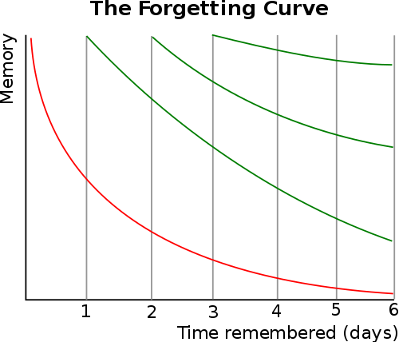

# 深度学习

> 我们看武侠小说都知道，习武之人，不仅要掌握招式，心法也很重要。

学习知识也一样，掌握高效的学习方法非常重要，特别是在现在这个互联网时代。

**想象一下我们是如何学习的？**

起床后刷手机
上班地铁上刷手机
等车时刷手机
睡觉前刷手机

无数的碎片化时间被手机支配，看新闻、看技术，看似了解了世界大小事，也学到了技术，没有浪费时间，但过一阵回顾一下，发现好像啥都没学到。

**为什么会这样呢？**

根据著名的遗忘曲线，信息输入大脑后，遗忘也就随之开始了，遗忘率随着时间的流逝先快后慢，特别是在刚刚识记的短时间，遗忘最快，这就是著名的[**艾宾浩斯遗忘曲线**](https://zh.wikipedia.org/wiki/%E9%81%97%E5%BF%98%E6%9B%B2%E7%BA%BF)。

遵循上述曲线所揭示的记忆规律，对所学知识及时进行复习十分重要。

记忆的保持又分为**短期记忆**和**长期记忆**，信息输入大脑后，便成为了人的短期记忆，在经过进一步强化后成为长期记忆。长期记忆的保持时间有长有短，为了让长期记忆能过保持，需要及时的复习。

了解了遗忘曲线后，我们再回到碎片化学习的问题上来，回忆一下，是不是每次看完觉得自己懂了，然后就结束了。

原来我们一直漏掉了**记录**和**复习**这个环节。

这些碎片化时间占据了一天中的相当一部分时间，如果利用好这些时间，你的生活将会完全不一样。

下面我们来看看如何才能将学习到的知识转变为长期知识。

## 深度学习 

- 点：及时记录零散知识点，如用Evernote等工具随时随地记录，可配合使用rss
- 线：追根溯源，多追问为什么，深入知识点的来龙去脉，将知识点串起来
- 面：将这些知识点脉络系统化，转化为脑图，便于记忆
- 博客：博客是一个将知识在大脑中重新回顾整理的过程，同时因为别人能看到，因此你会很重视。另外，及时的反馈也能给你自信或改进方向。这里可以参考费曼学习法（概念->教给别人->回顾->简化）

## 案例

浏览器的UserAgent
- 点：UserAgent格式是什么？
- 线：为什么会有UserAgent这个东西？
- 面：只是宿主环境提供的API的一部分
- 博客：（待补充）

## 参考
[坚持写博客的好处](https://www.cnblogs.com/xiaofuge/p/13884171.html)
